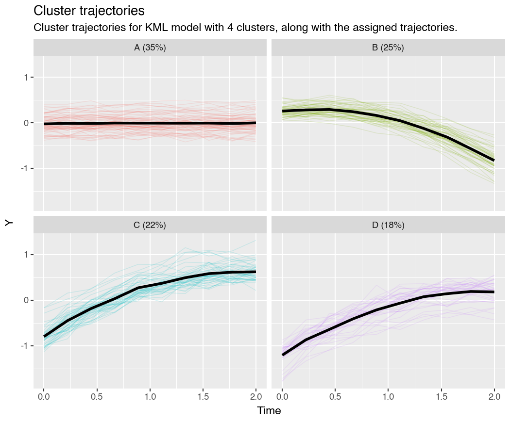

# latrend (Python)

[](https://github.com/s-rani1/latrend-py/actions)
[](https://www.python.org/downloads/)
[](https://www.gnu.org/licenses/old-licenses/gpl-2.0.html)

**Python port of the R package [latrend](https://github.com/niekdt/latrend) for longitudinal trajectory clustering.**

This project is an explicit effort to give Python users the core functionality and workflow of the R `latrend` package, while keeping a familiar Python API.

`latrend` provides a standardised framework to cluster longitudinal (trajectory) data.
The name is short for **la**tent-class **trend** analysis.  This Python port reproduces the
core pipeline, plotting theme, and API conventions of the upstream R package so that
analyses are interchangeable between languages.

---

## Installation

```bash
# Install from PyPI (recommended for users)
pip install latrend
```

```bash
# Install latest from GitHub (before/without PyPI release)
pip install "git+https://github.com/s-rani1/latrend-py.git"
```

```bash
# Editable install (development)
pip install -e ".[dev,plot]"
```

## Quickstart

```python
import latrend as lt

# Built-in demo dataset (mirrors R's data(latrendData))
data = lt.latrendData()

# Or generate synthetic trajectories
data = lt.generateLongData(nIndividuals=200, nClusters=3, seed=1)

# Cluster with Linear-Mixed K-Means
method = lt.lcMethodLMKM(formula="Y ~ Time", nClusters=3, seed=1)
model  = lt.latrendCluster(method, data)

# Visualise cluster trajectories (ggplot2-style if plotnine installed)
p = lt.plotClusterTrajectories(model, ci=True)

# Save the plot
try:
    p.save("cluster_trajectories.png", dpi=150)          # plotnine
except AttributeError:
    p.figure.savefig("cluster_trajectories.png", dpi=150) # matplotlib
```

## Features

### Clustering methods

| Method | Class | Description |
|---|---|---|
| Random baseline | `lcMethodRandom` | Assigns trajectories to clusters uniformly at random |
| KML-style | `lcMethodKML` | KMeans clustering on trajectory vectors (`kml_fast`/`kml_strict`) |
| Linear-mixed K-means | `lcMethodLMKM` | Per-individual linear regression + KMeans on coefficients |
| Feature-based | `lcMethodFeatures` | 20+ trajectory features + KMeans |
| R backend (any) | `lcMethodR` / dynamic `lcMethod*` | Delegates to the upstream R package via rpy2 |

### Pipeline

```python
# Single model
model = lt.latrendCluster(method, data)

# Batch: sweep over k = 1..6
models = lt.latrendBatchCluster(method, data, nClusters=range(1, 7))

# Repeated runs (different seeds) for stability
models = lt.latrendRepCluster(method, data, nRep=10)

# Model selection
best = models.bestModel(key="silhouette", maximize=True)
```

### KML Parity Mode

Use `kml_strict` to better match R KML behavior via multi-start selection:
- `kml_fast`: faster baseline.
- `kml_strict`: parity-focused mode for closer R-style clustering (not guaranteed exact 1:1 output).

```python
method = lt.lcMethodKML(
    nClusters=4,
    mode="kml_strict",      # or: "kml_fast"
    nStarts=20,
    nInit=100,
    maxIter=500,
    center=True,
    scale=False,
    distance="euclidean",
    seed=265368763,
)
model = lt.latrendCluster(method, data)
```

### Plotting (R ggplot2-matching theme)

All plots use `theme_light()` styling and the ggplot2 default discrete colour palette
(`#F8766D`, `#00BA38`, `#619CFF`, ...) so output looks identical to the R package.

```python
lt.plotTrajectories(data)                          # Spaghetti plot
lt.plotTrajectories(model, facet=True)              # Faceted by cluster
lt.plotClusterTrajectories(model, ci=True)          # Mean + 95% CI ribbon
lt.plotClusterTrajectories(model, trajectories=True) # With individual overlay
lt.plotMetric(models)                               # Elbow / silhouette plot
lt.plotClassProportions(model)                      # Cluster size bar chart
lt.plotClassProbabilities(model)                    # Posterior histograms
```

**Backends:** Uses [plotnine](https://plotnine.readthedocs.io/) (ggplot2-like) when installed;
falls back to matplotlib otherwise.

#### Reproducing R `plot(kmlModel4)`

```python
from pathlib import Path
import pandas as pd
import latrend as lt
from plotnine import labs

# Example paths (repo-local)
repo = Path(".")
df = pd.read_csv(repo / "tests" / "data" / "latrend_data.csv").drop(
    columns=["Unnamed: 0"], errors="ignore"
)
assign = pd.read_csv(repo / "tests" / "data" / "kml_model4_assignments.csv")

# Build LCModel from fixed assignments
clusters = assign.set_index("Id")["Cluster"]
method = lt.LCMethod(id="Id", time="Time", outcome="Y", name="KML")
model = lt.LCModel(method=method, data=df[["Id", "Time", "Y"]], clusters=clusters)

# Equivalent of R's plot(kmlModel4): faceted assigned trajectories + black mean line
p = lt.plotClusterTrajectories(
    model,
    trajectories=True,
    backend="plotnine",
    figure_size=(7, 5.8),
    base_size=11,
)
p = p + labs(
    subtitle="Cluster trajectories for KML model with 4 clusters, along with the assigned trajectories."
)

p.save("docs/images/kml_model4_python_generated.png", dpi=150)
```



### Data utilities

```python
lt.latrendData()                  # Built-in 200-trajectory dataset
lt.generateLongData(...)          # Custom synthetic data
lt.tsmatrix(data)                 # Long -> wide format
lt.tsframe(wide_matrix)           # Wide -> long format
lt.trajectories(method, data)     # Per-individual trajectory dict
```

### Reporting

```python
lt.lcModelReport(model, "output/")   # Markdown report + PNG plots
```

## Optional R backend

If you have R + the R package `latrend` installed, any missing `lcMethod*` constructor
is automatically delegated to R via rpy2:

```bash
pip install -e ".[r]"
```

```python
method = lt.lcMethodLcmmGMM(formula="Y ~ Time", nClusters=3)
model  = lt.latrendCluster(method, data)  # runs in R
```

## Project structure

```
latrend_py/
  src/latrend/
    __init__.py          # Public API
    core/                # LCMethod, LCModel, pipeline, matrix converters
    data/                # Data generation + built-in latrendData
    methods/             # lcMethodRandom, lcMethodKML, lcMethodLMKM, lcMethodFeatures, lcMethodR
    metrics/             # Silhouette score
    plots/               # All plotting functions + theme
    backends/            # rpy2-based R integration
    report.py            # Markdown report generator
  tests/
  .github/workflows/    # CI (Python 3.9-3.12)
```

## Running tests

```bash
pytest -q
```

## Contributing

See [CONTRIBUTING.md](CONTRIBUTING.md) for development setup and guidelines.

## Citation

If you use `latrend` (Python) in academic work, please cite this repository.
Citation metadata is provided in [CITATION.cff](CITATION.cff) (GitHub will expose this via "Cite this repository").

## License

GPL-2.0-or-later (aligned with the upstream R package).

## Acknowledgements

This package is a Python port of the [latrend](https://github.com/niekdt/latrend) R package
by Niek Den Teuling (Philips Research).
